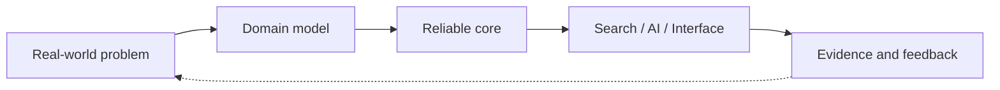

<div align="center">

<a href="https://github.com/jeeva-m-21">
  
</a>

<a href="https://git.io/typing-svg">
  
</a>

<p>
  <a href="https://jeeva-m.vercel.app"></a>
  <a href="https://www.linkedin.com/in/jeeva4772/"></a>
  <a href="mailto:jeeva4772@gmail.com"></a>
  <a href="https://github.com/jeeva-m-21?tab=repositories"></a>
</p>


</div>

---

## The short version

I am an engineer who likes the layer where ideas become systems.

I build AI-native products, research infrastructure, and edge-intelligence prototypes — then make the architecture explicit enough that another engineer can understand the trade-offs, run the project, and extend it.

```text
problem → domain model → working system → evidence → iteration
```

Currently studying at Vellore Institute of Technology and building from Chennai, India.

## What I am building

<table>
<tr>
<td width="50%" valign="top">

### ResearchOS

An open research operating system for experiments, notebooks, papers, artifacts, provenance, and AI-assisted discovery.

`DDD` `Hexagonal Architecture` `FastAPI` `PostgreSQL` `pgvector` `Redis Streams` `Next.js`

<a href="https://github.com/jeeva-m-21/ResearchOS">→ inspect the architecture</a>

</td>
<td width="50%" valign="top">

### ProblemAtlas

A problem-centric platform for finding real-world gaps and turning them into collaborative solution spaces.

`TypeScript` `React` `Next.js` `Tailwind` `Framer Motion`

<a href="https://github.com/jeeva-m-21/ProblemAtlas">→ explore the product</a>

</td>
</tr>
<tr>
<td width="50%" valign="top">

### ForgeMCU

Exploring agentic workflows for embedded development, firmware generation, and hardware-aware tooling.

`Embedded` `MCU` `Firmware` `AI`

<a href="https://github.com/jeeva-m-21/ForgeMCU">→ see the workbench</a>

</td>
<td width="50%" valign="top">

### Edge intelligence

Computer vision for agriculture and sensing: crop density, leaf segmentation, and water monitoring.

`Python` `YOLOv8` `OpenCV` `Computer Vision`

<a href="https://github.com/jeeva-m-21?tab=repositories">→ browse the experiments</a>

</td>
</tr>
</table>

## Systems I enjoy designing



- **Research platforms:** experiment lineage, notebooks, papers, artifacts, and reproducibility
- **Knowledge systems:** vector search, full-text search, graph relationships, and retrieval workflows
- **AI products:** agents that use tools and data instead of only producing chat
- **Edge ML:** useful predictions under real-world constraints
- **Developer experience:** clear defaults, automation, docs, and feedback loops

## Tech constellation

<div align="center">


</div>

## Engineering principles

| Principle | What it means in practice |
|---|---|
| Model before scaling | Understand the domain before adding infrastructure. |
| Boring boundaries, ambitious outcomes | Keep interfaces explicit so the product can move fast. |
| Evidence over theatre | Tests, measurements, diagrams, and reproducible runs beat claims. |
| Prototype honestly | Separate what works today from what is planned next. |
| Leave a map | Good documentation is part of the implementation. |

## Signal dashboard

<div align="center">

<a href="https://github.com/jeeva-m-21">
  
</a>
<a href="https://github.com/jeeva-m-21">
  
</a>

<br />

<a href="https://github.com/jeeva-m-21">
  
</a>

</div>

## Open to

Internships, research collaborations, and ambitious engineering problems involving AI systems, developer tools, backend architecture, or edge intelligence.

If the problem is difficult, concrete, and worth building, [let's talk](mailto:jeeva4772@gmail.com).

<div align="center">

<sub>Built with intent · documented with care · shipped one iteration at a time</sub>


</div>
