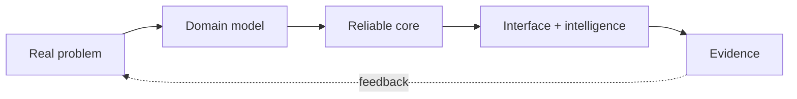

<div align="center">

<a href="https://github.com/jeeva-m-21">
  
</a>

<a href="https://git.io/typing-svg">
  
</a>

<p>
  <a href="https://jeeva-m.vercel.app"></a>
  <a href="https://www.linkedin.com/in/jeeva4772/"></a>
  <a href="mailto:jeeva4772@gmail.com"></a>
</p>

<sub>Chennai, India · Vellore Institute of Technology · open to internships and research collaborations</sub>

</div>

---

## In 30 seconds

I build AI-native products and the infrastructure beneath them. My strongest work sits at the intersection of **backend architecture, retrieval systems, developer tooling, and edge ML**.

I care about the part after the demo: explicit boundaries, reproducible experiments, useful interfaces, and documentation that lets another engineer take over.

```text
understand the problem  →  model the domain  →  ship a small system  →  measure  →  iterate
```

## Selected work

### ResearchOS · research infrastructure

An open research operating system for experiments, notebooks, papers, artifacts, provenance, and AI-assisted discovery.

**Interesting because:** it treats research objects as connected, versioned domain objects rather than isolated files.

**Built with:** `Python` `FastAPI` `PostgreSQL` `pgvector` `Redis Streams` `Next.js` `TypeScript`

[Read the architecture →](https://github.com/jeeva-m-21/ResearchOS)

---

### ProblemAtlas · problem intelligence

A problem-centric platform for discovering real-world gaps and turning them into collaborative solution spaces.

**Interesting because:** the product starts with the problem and its evidence, not with a generic project-management workflow.

**Built with:** `Next.js` `React` `TypeScript` `Tailwind CSS` `Framer Motion`

[Explore the prototype →](https://github.com/jeeva-m-21/ProblemAtlas)

---

### ForgeMCU · embedded systems tooling

An exploration of agentic workflows for embedded development, firmware generation, and hardware-aware tooling.

**Interesting because:** it asks how AI can assist with constrained, hardware-connected work instead of only generating web code.

**Focus:** `Embedded systems` `MCU` `Firmware` `AI workflows`

[See the workbench →](https://github.com/jeeva-m-21/ForgeMCU)

---

### Edge intelligence · computer vision

Projects around crop-density estimation, leaf segmentation, and water monitoring — applying computer vision where predictions need to be practical and close to the field.

**Focus:** `Python` `YOLOv8` `OpenCV` `Precision agriculture`

[Browse the experiments →](https://github.com/jeeva-m-21?tab=repositories)

## How I think about systems



- **Model before scaling** — understand the domain before adding infrastructure.
- **Evidence over theatre** — tests, measurements, diagrams, and reproducible runs beat claims.
- **Prototype honestly** — make the boundary between working, experimental, and planned obvious.
- **Leave a map** — architecture decisions and setup instructions are part of the product.

## Current technical orbit

<div align="center">

</div>

<details>
<summary><b>What I use these for</b></summary>
<br />

| Area | Tools |
|---|---|
| Application systems | Python, FastAPI, TypeScript, React, Next.js |
| Data and retrieval | PostgreSQL, pgvector, Redis, hybrid search |
| AI and vision | PyTorch, YOLOv8, OpenCV, embeddings, tool-using agents |
| Delivery | Docker, Kubernetes, GitHub Actions, Linux |
| Design habits | DDD, hexagonal architecture, event-driven systems, testable boundaries |

</details>

## A note to future collaborators

I am looking for work where the problem is concrete, the technical bar is high, and there is room to learn from people who have shipped systems at scale.

If you are building in **AI systems, research tooling, backend architecture, developer experience, or edge intelligence**, [I would like to hear from you](mailto:jeeva4772@gmail.com).

<div align="center">

<a href="https://github.com/jeeva-m-21?tab=repositories"></a>
<a href="https://jeeva-m.vercel.app"></a>

<br /><br />

<sub>Built with intent · documented with care · improved in public</sub>


</div>
